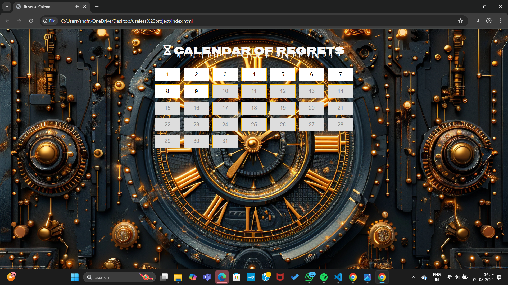

# [Project Name] 🎯 calendar of regret

## Basic Details
### Team Name: [MYC]

### Team Members
- Team Lead: Joyal blesson - College of engineering poonjar
- Member 2: Shafna K N - College of engineering poonjar

### Project Description
The Reverse Calendar is a quirky, Halloween-themed web app where you can only view and interact with past and present dates — future dates trigger sarcastic pop-ups with spooky images and sounds. Featuring creepy fonts, eerie background music, and playful messages, it turns a simple calendar into an amusing, time-twisting experience. It’s a fun blend of humor, design, and interactivity perfect for seasonal or novelty web projects.

### The Problem (that doesn't exist)
The “problem” (that doesn’t actually exist) is that people keep trying to look into the future on a calendar

### The Solution (that nobody asked for)
the "Calendar Of regret" solves it by blocking all future dates with snarky, spooky messages and images.

## Technical Details
### Technologies/Components Used
For Software:
- HTML,CSS,JS
- AI IMAGE GENERATOR,GPT

# Screenshots (Add at least 3)

*IT EXPLAIN ABOUT HOW THE WEBSITE LOOK LIKE WHEN OPEN*

.png)

*it shows how the page looks like when we  click on the future dates*

.png)

*it shows how the page looks like when we  click on the  past dates*
.png)

*it shows how the page looks like when we  click on the  present  date*

---
Made with ❤️ at TinkerHub Useless Projects 

